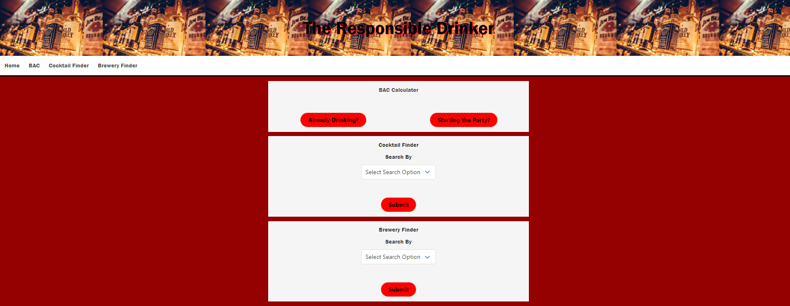
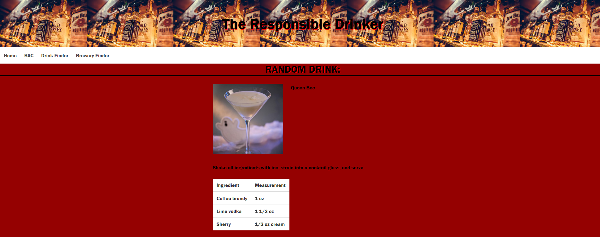

# The Responsible Drinker

## Website Description
This website provides multiple functions to allow the user to have fun while also drinking responsibly.  The main function is a Blood Alcohol Content Calculator which allows the user to either track their BAC over time or make a one time calculation.  The secondary functions are a cocktail and brewery finder.  The cocktail finder allows user to either search for a random drink or search for a drink by its name.  The brewery finder allws the user to search for breweries by their location or or name.   

## Languages
HTML
CSS
Bulma Framework
javaScript
jQuery

## APIs Used
CocktailDB
openBreweryDB

## Website Screenshots
  
  

## Website Link
https://mjd10m.github.io/the-responsible-drinker/

## Contributers
Michael Dougherty
Justin Wilson
Anthony Winston
Lucas Ramos